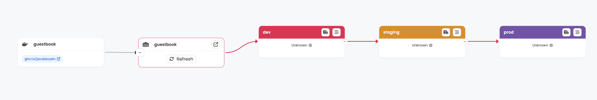

# Kargo Simple Example

This is a GitOps repository of a simple Kargo example for getting started.

### Features:

* A Warehouse which monitors a container repository for new images
* Three Stage (dev, staging, prod) deploy pipeline
* Image tag promotion
* PromotionTask with a conditional pull request
* Direct Git commits to dev, staging
* Pull request for promotion to prod

This example does not require an Argo CD instance and so would work with any
GitOps operator (Argo CD, Flux) that detects and deploys manifest changes from
a path in a Git repository automatically (e.g. using auto-sync).

## Requirements

* Kargo v1.3.x (for older Kargo versions, switch to the release-X.Y branch)
* GitHub and a container registry (GHCR.io)
* `git` and `docker` installed

## Instructions

1. Fork this repo, then clone it locally (from your fork).
2. Run the `personalize.sh` to customize the manifests to use your GitHub
   username:

   ```shell
   ./personalize.sh <yourgithubusername>
   ```
3. `git commit` the personalized changes:

   ```shell
   git commit -a -m "personalize manifests"
   git push
   ```
4. Create a guestbook container image repository in your GitHub account. 

   The easiest way to create a new ghcr.io image repository, is by retagging and 
   pushing an existing image with your GitHub username. See [Authenticating to the GitHub Container Registry](https://docs.github.com/en/packages/working-with-a-github-packages-registry/working-with-the-container-registry#authenticating-to-the-github-container-registry)
   for instructions on how to log in to ghcr.io with Docker.

   ```shell
   docker login ghcr.io

   docker buildx imagetools create \
     ghcr.io/akuity/guestbook:latest \
     -t ghcr.io/<yourgithubusername>/guestbook:v0.0.1
   ```

   You will now have a `guestbook` container image repository. e.g.:
   https://github.com/users/yourgithubusername/packages/container/package/guestbook

5. Change guestbook container image repository to public.

   In the GitHub UI, navigate to the "guestbook" container repository, Package
   settings, and change the visibility of the package to public. This will allow
   Kargo to monitor this repository for new images, without requiring you to 
   configuring Kargo with container image repository credentials.

   

6. Download and install the latest CLI from [Kargo Releases](https://github.com/akuity/kargo/releases/latest)

   ```shell
   ./download-cli.sh /usr/local/bin/kargo
   ```

7. Login to Kargo:

   ```shell
   kargo login --admin https://<kargo-url>
   ```
   
    You may need to use the `--insecure-skip-tls-verify` flag if your Kargo
    instance is using a self-signed or untrusted TLS certificate.

8. Apply the Kargo manifests:

   ```shell
   kargo apply -f ./kargo
   ```

9. Add the Git repository credentials to Kargo. This can also be done in the UI
   in the `kargo-simple` Project.

   ```shell
   kargo create credentials github-creds \
     --project kargo-simple \
     --git \
     --username <yourgithubusername> \
     --repo-url https://github.com/<yourgithubusername>/kargo-simple.git
   ```

   As part of the promotion process, Kargo requires privileges to commit changes
   to your Git repository, as well as the ability to create pull requests. Ensure
   that the given token has these privileges.  See [Managing your personal access tokens](https://docs.github.com/en/authentication/keeping-your-account-and-data-secure/managing-your-personal-access-tokens)
   for further instructions on managing GitHub tokens.

10. Promote the image!

    You now have a Kargo Pipeline which promotes images from the guestbook
    container image repository, through a three-stage deploy pipeline. Visit
    the `kargo-simple` Project in the Kargo UI to see the deploy pipeline.

    

    To promote, click the truck icon in the `dev` Stage, click Promote, select
    the detected Freight, and confirm the promotion. Alternatively, you can drag the
    freight from the Warehouse to the `dev` Stage. Once promoted, 
    the Freight will be qualified to be promoted to downstream Stages (`staging`, `prod`).

    


## Simulating a release

To simulate a release, simply retag an image with a newer semantic version. e.g.:

```shell
docker buildx imagetools create \
  ghcr.io/akuity/guestbook:latest \
  -t ghcr.io/<yourgithubusername>/guestbook:v0.0.2
```

Then refresh the Warehouse in the UI to detect the new Freight.
